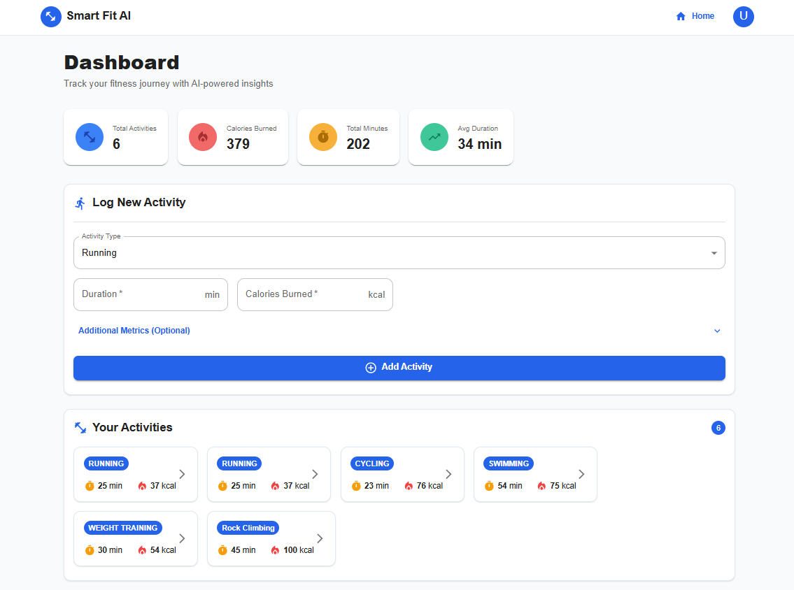
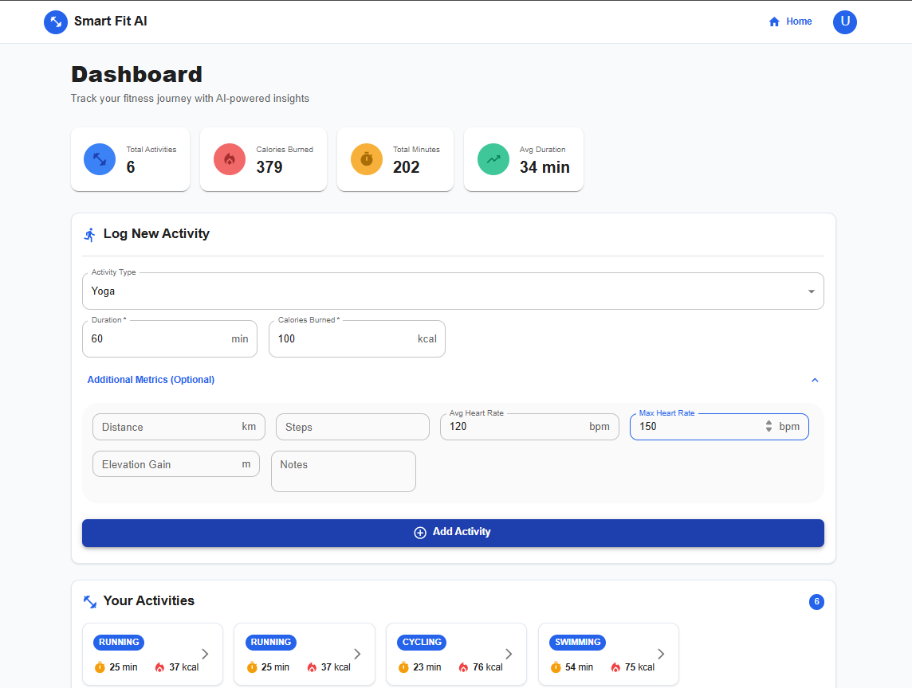
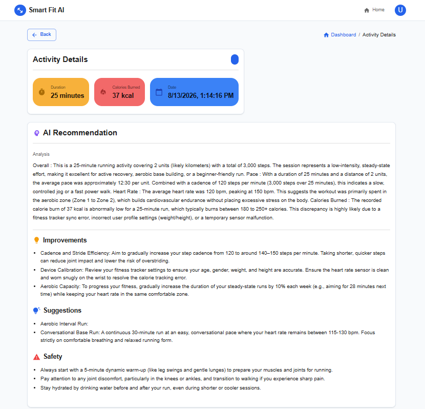
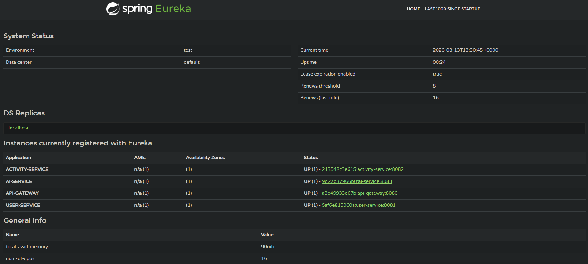
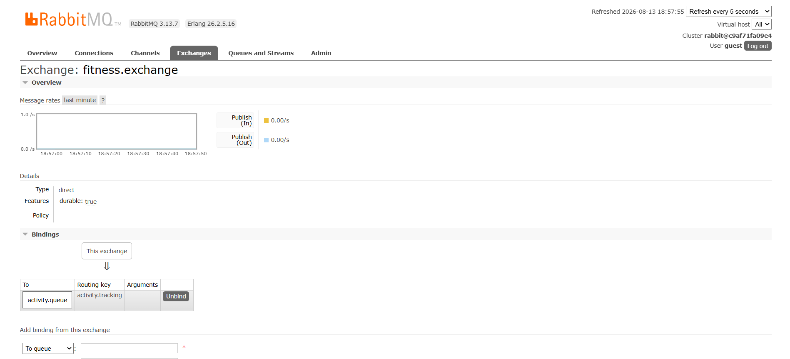
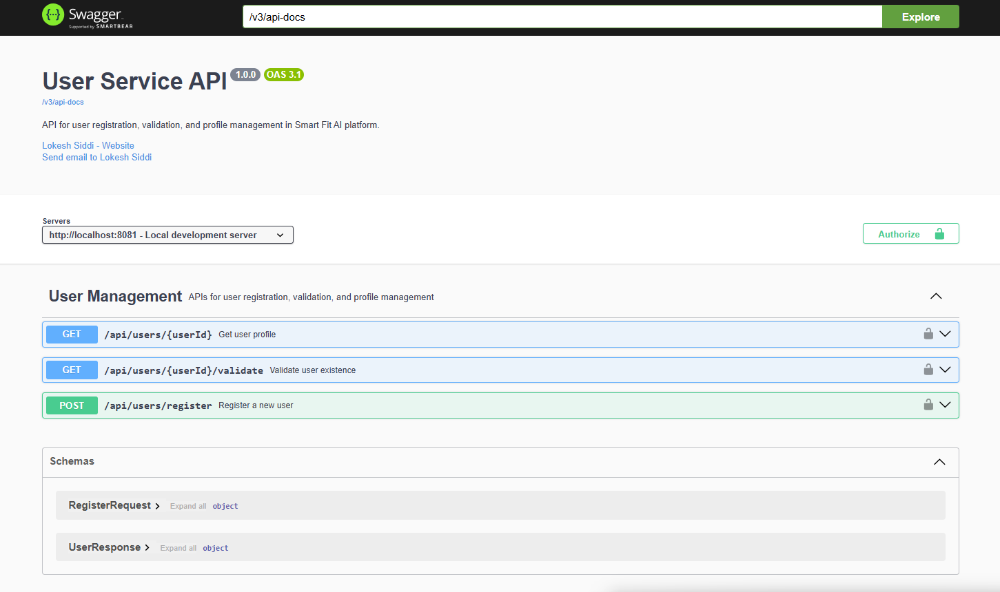
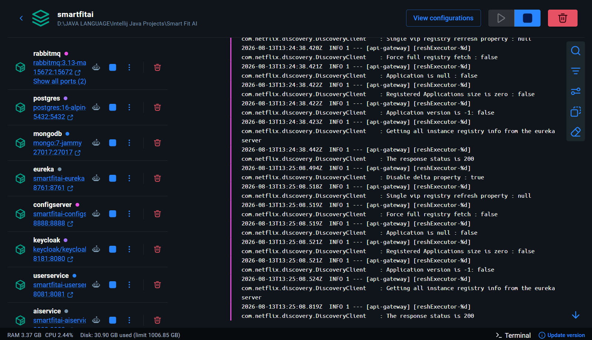
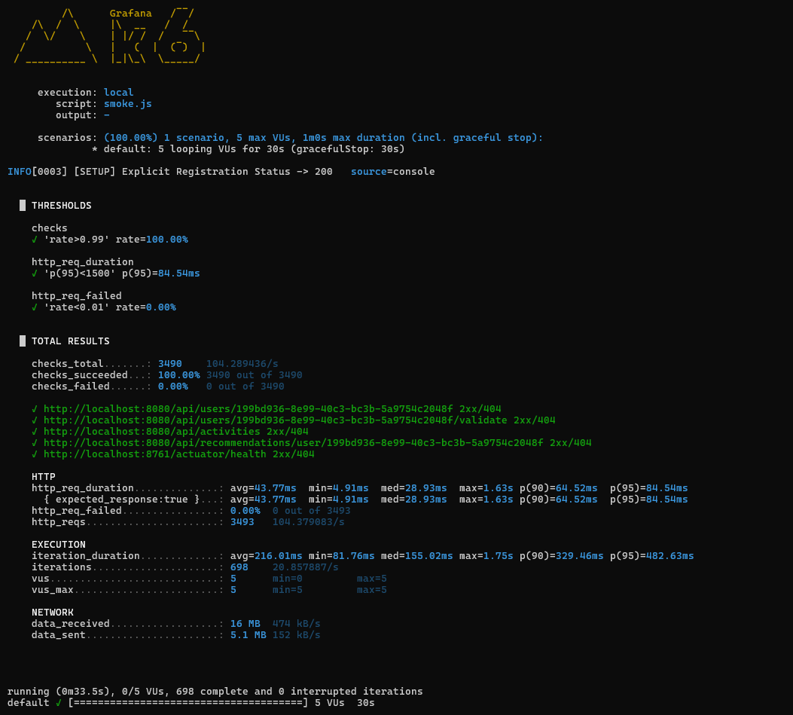
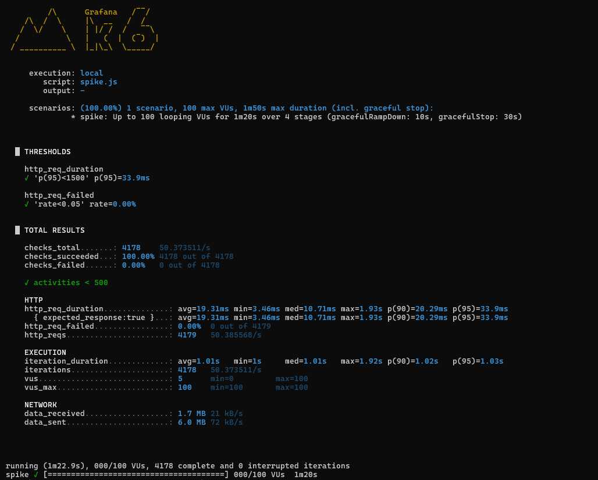
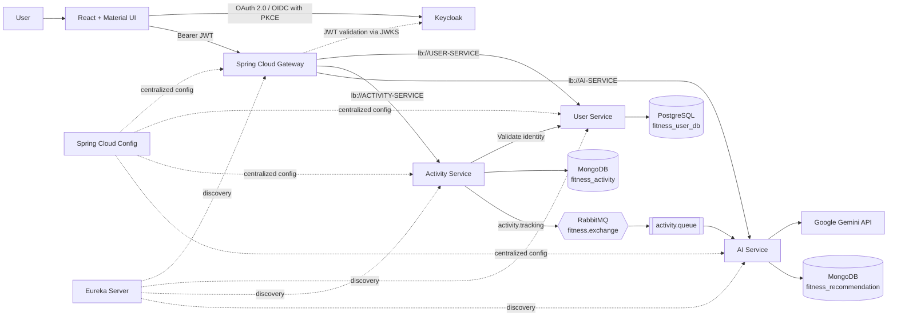

<div align="center">

# 🏋️ Smart Fit AI

### An event-driven, AI-powered fitness platform built as a secure Spring Cloud microservices system

Track workouts, capture rich fitness metrics, and receive asynchronous recommendations generated with Google Gemini.

[](https://openjdk.org/projects/jdk/21/)
[](https://spring.io/projects/spring-boot)
[](https://react.dev/)
[](https://www.keycloak.org/)
[](https://docs.docker.com/compose/)
[](LICENSE)

[Features](#-features) · [Architecture](#-architecture) · [Quick start](#-quick-start) · [API](#-api-overview) · [Testing](#-testing--performance) · [Roadmap](#-roadmap)

</div>

---

## Overview

**Smart Fit AI** is a full-stack fitness platform and distributed-systems project. A React client authenticates through Keycloak, sends JWT-protected requests to Spring Cloud Gateway, and lets users record activities such as running, cycling, swimming, weight training, yoga, and custom workouts.

When an activity is created, the platform stores it in MongoDB and publishes an event to RabbitMQ. The AI service consumes that event, asks Google Gemini for structured feedback, persists the result, and exposes the analysis, improvement areas, workout suggestions, and safety guidance to the user.

The repository demonstrates more than CRUD: it combines service discovery, centralized configuration, API gateway routing, OAuth 2.0/OIDC, asynchronous messaging, database-per-service, AI integration, container orchestration, API documentation, automated tests, and performance engineering.

> [!NOTE]
> This is a portfolio/learning project, not a medical device. AI-generated output should not replace advice from a qualified health professional.

---

## 🎥 Live Demo

<div align="center">

<video src="https://github.com/LokeshSiddi/Smart-Fit-AI/raw/main/docs/Project%20Demo.mp4" width="100%" controls autoplay loop muted>
</video>

[Smart Fit AI Demo Link](https://youtu.be/OeZqiw7siUk)

<sub><b>Watch Smart Fit AI in action — Keycloak OAuth2 PKCE login, activity logging, RabbitMQ messaging, and Gemini AI analysis.</b></sub>

</div>

---

## ✨ Features

### Product

- **Secure sign-in and registration** using Keycloak, OpenID Connect, and the OAuth 2.0 Authorization Code flow with PKCE.
- **Activity tracking** for nine built-in categories plus custom activities.
- **Flexible workout metrics** including distance, steps, average/max heart rate, elevation gain, and notes.
- **Personal dashboard** with total activities, calories burned, total minutes, and average workout duration.
- **AI recommendations** split into performance analysis, improvements, next-workout suggestions, and safety guidance.
- **Graceful AI fallback** so an unavailable or malformed model response does not break the activity workflow.

### Engineering

- **Six Spring Boot modules:** Gateway, Eureka, Config Server, User Service, Activity Service, and AI Service.
- **Event-driven processing:** `fitness.exchange` → `activity.tracking` → `activity.queue` decouples activity creation from AI generation.
- **Database-per-service:** PostgreSQL for relational user data; separate MongoDB databases for activities and recommendations.
- **Service-to-service discovery:** Eureka-backed, load-balanced Gateway routes and `WebClient` calls.
- **Centralized configuration:** Spring Cloud Config supplies service ports, data stores, discovery, messaging, security, and actuator settings.
- **Structured API errors:** service-specific exceptions and global exception handlers return consistent error payloads.
- **Operational tooling:** health checks, Actuator, Swagger/OpenAPI, RabbitMQ Management UI, Eureka dashboard, k6, InfluxDB, and Grafana.
- **Reproducible local environment:** an 11-container Docker Compose stack with persistent volumes and dependency-aware health checks.

---

## 📸 App Screenshots & Visuals

<div align="center">

<marquee behavior="scroll" direction="left" scrollamount="5" loop="infinite" onmouseover="this.stop();" onmouseout="this.start();">
  
  &nbsp;
  
  &nbsp;
  
  &nbsp;
  
  &nbsp;
  
  &nbsp;
  
  &nbsp;
  
  &nbsp;
  
  &nbsp;
  
</marquee>

<sub>💡 <b>Hover over the marquee to pause scrolling.</b></sub>

</div>

<br />

<details>
<summary><b>🔍 Click here to expand detailed high-resolution screenshot grid</b></summary>
<br />

<table>
  <tr>
    <td width="50%" align="center">
      
      <br /><sub><b>Activity dashboard & aggregate statistics</b></sub>
    </td>
    <td width="50%" align="center">
      
      <br /><sub><b>Activity entry with extended metrics</b></sub>
    </td>
  </tr>
  <tr>
    <td colspan="2" align="center">
      
      <br /><sub><b>Gemini-generated workout feedback and safety guidance</b></sub>
    </td>
  </tr>
  <tr>
    <td width="50%" align="center">
      
      <br /><sub><b>Eureka Service Registry</b></sub>
    </td>
    <td width="50%" align="center">
      
      <br /><sub><b>RabbitMQ direct exchange & queue bindings</b></sub>
    </td>
  </tr>
  <tr>
    <td width="50%" align="center">
      
      <br /><sub><b>OpenAPI / Swagger UI Documentation</b></sub>
    </td>
    <td width="50%" align="center">
      
      <br /><sub><b>11-Container Docker Compose Stack</b></sub>
    </td>
  </tr>
  <tr>
    <td width="50%" align="center">
      
      <br /><sub><b>k6 Smoke Test (0% Error Rate)</b></sub>
    </td>
    <td width="50%" align="center">
      
      <br /><sub><b>k6 100-VU Spike Test (33.9ms p95)</b></sub>
    </td>
  </tr>
</table>

</details>

---

## 🏗 Architecture



### Activity-to-recommendation flow

1. The React client obtains a Keycloak access token using Authorization Code + PKCE.
2. Spring Cloud Gateway validates the JWT and synchronizes a first-time Keycloak identity with the User Service.
3. The Activity Service verifies that the user exists, validates the request, and stores the activity in MongoDB.
4. The Activity Service publishes the saved activity to the RabbitMQ direct exchange.
5. The AI Service consumes the event and builds a structured prompt from the activity and optional metrics.
6. Gemini returns JSON containing analysis, improvements, suggestions, and safety guidance.
7. The AI Service parses and stores the recommendation in MongoDB.
8. The frontend retrieves the recommendation by activity ID. Activity creation and AI generation remain decoupled.

## 🧩 Services and ports

| Component | Port | Responsibility | Data/dependency |
|---|---:|---|---|
| React frontend | `5173` | Authentication, dashboard, activity entry, recommendation UI | Nginx in Docker |
| API Gateway | `8080` | JWT validation, CORS, identity sync, service routing | Keycloak + Eureka |
| User Service | `8081` | User registration, profile lookup, user validation | PostgreSQL |
| Activity Service | `8082` | Activity persistence, history, user validation, event publication | MongoDB + RabbitMQ |
| AI Service | `8083` | Event consumption, Gemini integration, recommendation persistence | RabbitMQ + MongoDB |
| Config Server | `8888` | Centralized native configuration | Classpath config repository |
| Eureka Server | `8761` | Service registration and discovery | Spring Cloud Netflix |
| Keycloak | `8181` | OAuth 2.0/OIDC identity provider and JWT issuer | PostgreSQL |
| RabbitMQ | `5672` / `15672` | AMQP broker / management console | Durable queue and direct exchange |
| PostgreSQL | `5432` | User and Keycloak relational data | Two logical databases |
| MongoDB | `27017` | Activities and recommendations | Two logical databases |

## 🛠 Technology stack

| Layer | Technologies |
|---|---|
| Frontend | React 19, Vite 7, Material UI 7, Redux Toolkit, Axios, React Router |
| Backend | Java 21, Spring Boot 3.5.3, Spring Cloud 2025.0, WebFlux, WebClient |
| Cloud patterns | Spring Cloud Gateway, Netflix Eureka, Spring Cloud Config, LoadBalancer |
| Security | Keycloak 26, OAuth 2.0, OpenID Connect, PKCE, JWT Resource Server, BCrypt |
| Messaging | RabbitMQ, Spring AMQP, Jackson JSON message conversion |
| Persistence | PostgreSQL 16, Spring Data JPA, MongoDB 7, Spring Data MongoDB |
| AI | Google Gemini API, structured prompting, JSON response parsing |
| API/operations | Springdoc OpenAPI, Swagger UI, Actuator, health checks |
| Testing | JUnit 5, Mockito, MockWebServer, Reactor Test, Grafana k6 |
| Performance telemetry | InfluxDB + Grafana dashboard and custom k6 metrics |
| Delivery | Maven multi-module build, Docker, Docker Compose, Nginx, GitHub Actions |

## 🚀 Quick start

### Prerequisites

- Git
- Docker Engine/Desktop with Docker Compose v2
- A [Google AI Studio](https://aistudio.google.com/app/apikey) API key
- Approximately 4 GB of free RAM for the complete local stack

Java, Maven, Node.js, PostgreSQL, MongoDB, RabbitMQ, and Keycloak do **not** need to be installed separately when using Docker Compose.

### 1. Clone and configure

```bash
git clone https://github.com/LokeshSiddi/Smart-Fit-AI.git
cd Smart-Fit-AI
cp .env.example .env
```

Open `.env` and replace the placeholder values, especially:

```dotenv
POSTGRES_USER=postgres
POSTGRES_PASSWORD=choose_a_local_password
RABBITMQ_USER=guest
RABBITMQ_PASSWORD=guest
GEMINI_API_URL=https://generativelanguage.googleapis.com/v1beta/models/<model>:generateContent?key=
GEMINI_API_KEY=your_google_ai_key
```

> [!IMPORTANT]
> Keep `.env` out of source control. The credentials and admin accounts in Docker Compose are development defaults and must be replaced before any non-local deployment.

### 2. Start the platform

```bash
docker compose up --build -d
```

The first build downloads Maven, npm, container, and model-client dependencies, so it can take several minutes.

```bash
# Check container health
docker compose ps

# Follow application logs
docker compose logs -f gateway userservice activityservice aiservice
```

### 3. Use the application

1. Open [http://localhost:5173](http://localhost:5173).
2. Select **Get Started**.
3. Sign in or create an account in the imported `fitness-oauth2` Keycloak realm.
4. Log an activity. The recommendation is generated asynchronously, so allow a few seconds before opening its details.

### 4. Stop or reset

```bash
# Stop containers and keep persisted data
docker compose down

# Stop containers and delete local PostgreSQL/MongoDB/RabbitMQ volumes
docker compose down -v
```

## 🔗 Local dashboards and documentation

| Tool | URL | Local credentials |
|---|---|---|
| Application | http://localhost:5173 | Register through Keycloak |
| Gateway health | http://localhost:8080/actuator/health | Public health endpoint |
| Eureka dashboard | http://localhost:8761 | — |
| Config Server | http://localhost:8888 | — |
| Keycloak Admin | http://localhost:8181/admin | `admin` / `admin` by default |
| RabbitMQ Management | http://localhost:15672 | `.env` values; default `guest` / `guest` |
| User Swagger UI | http://localhost:8081/swagger-ui.html | — |
| Activity Swagger UI | http://localhost:8082/swagger-ui.html | — |
| AI Swagger UI | http://localhost:8083/swagger-ui.html | — |

## 📡 API overview

All client traffic should go through `http://localhost:8080`. Except for `/actuator/**`, Gateway routes require a valid Keycloak bearer token. The gateway derives/injects `X-User-ID` from the authenticated identity.

| Method | Route | Purpose |
|---|---|---|
| `POST` | `/api/users/register` | Create or synchronize a user profile |
| `GET` | `/api/users/{userId}` | Retrieve a profile by Keycloak ID |
| `GET` | `/api/users/{userId}/validate` | Check whether a user exists |
| `POST` | `/api/activities` | Store an activity and publish its AI-processing event |
| `GET` | `/api/activities` | List activities for the authenticated user |
| `GET` | `/api/activities/{activityId}` | Retrieve an activity |
| `GET` | `/api/recommendations/user/{userId}` | List a user's recommendations |
| `GET` | `/api/recommendations/activity/{activityId}` | Retrieve one activity's recommendation |

### Example activity payload

```json
{
  "type": "RUNNING",
  "duration": 25,
  "caloriesBurned": 220,
  "startTime": "2026-08-13T18:30:00",
  "additionalMetrics": {
    "distance": 4.2,
    "steps": 5100,
    "averageHeartRate": 132,
    "maxHeartRate": 158,
    "elevationGain": 42,
    "notes": "Easy evening run"
  }
}
```

`userId` is intentionally omitted from the client payload—the gateway supplies the authenticated identity.

## 🧪 Testing & performance

### Automated tests

The repository currently contains **19 test classes** with **77 `@Test` methods** and **8 `@ParameterizedTest` methods** across the six Spring modules. Coverage includes controllers, service logic, validation, gateway identity synchronization, reactive WebClient behavior, RabbitMQ listeners, Gemini response parsing, fallbacks, and exception paths.

```bash
# Run all backend tests from the repository root
bash mvnw test

# Build and lint the frontend
cd fitness-app-frontend
npm ci --legacy-peer-deps
npm run build
npm run lint
```

### k6 suite

`k6-tests/` contains separate smoke, spike, soak, Keycloak, Eureka, and mixed-journey test scripts, plus InfluxDB/Grafana provisioning and a report generator.

| Test | Configured profile | Purpose |
|---|---|---|
| `smoke.js` | 5 VUs for 30 seconds | Pre-deployment health and API sanity |
| `spike.js` | 5 → 100 VUs → 5 over 80 seconds | Sudden-load and recovery behavior |
| `soak.js` | 50 VUs for 1 hour | Latency drift, leaks, and pool exhaustion |
| `smart-fit-ai-loadtest.js` | Staged journey to 400 VUs + 500 RPS arrival scenario | Mixed endpoints, SLOs, infrastructure, and async AI pipeline |
| `keycloak-token.js` | 200 token requests/second | Authentication-server capacity |
| `eureka-discovery.js` | 20 VUs for 5 minutes | Registry availability under load |

Run the short profiles after the application stack is healthy:

```bash
cd k6-tests
k6 run smoke.js
k6 run spike.js
```

Launch performance telemetry:

```bash
docker compose -f docker-compose.test.yml --profile grafana up -d influxdb grafana
docker compose -f docker-compose.test.yml --profile load up k6-load
```

Grafana is then available at [http://localhost:3000](http://localhost:3000) with the provisioned **Smart-Fit-AI — k6 Load Test** dashboard.

### Observed local results

The following results are taken from the included local-run screenshots. Performance varies with hardware, container resources, dataset size, and selected endpoints.

| Run | HTTP requests | Average throughput | p95 latency | HTTP failure rate |
|---|---:|---:|---:|---:|
| Smoke — 5 VUs, 30 s | 3,493 | 104.38 req/s | 84.54 ms | 0.00% |
| Spike — up to 100 VUs, 80 s | 4,179 | 50.39 req/s | 33.9 ms | 0.00% |

## 📁 Repository structure

```text
Smart-Fit-AI/
├── activityservice/          # Activity API, MongoDB, user validation, RabbitMQ publisher
├── aiservice/                # RabbitMQ consumer, Gemini integration, recommendations
├── userservice/              # User profiles and PostgreSQL persistence
├── gateway/                  # JWT security, Keycloak user sync, service routing
├── eureka/                   # Service registry
├── configserver/             # Centralized native Spring configuration
├── fitness-app-frontend/     # React/Vite/Material UI client served by Nginx
├── keycloak/                 # Importable OAuth2 realm and PKCE client
├── k6-tests/                 # Smoke, spike, load, soak, auth, discovery, Grafana
├── docs/screenshots/         # README assets
├── docker-compose.yml        # Complete local platform
├── init-db.sql               # Dedicated Keycloak database initialization
└── pom.xml                   # Parent Maven POM and dependency management
```

## 🧠 Design decisions

- **Asynchronous AI generation:** Model latency and rate limits should not block activity persistence. RabbitMQ isolates the write path from recommendation processing.
- **Polyglot persistence:** User identity/profile data has relational constraints, while activities and model output are evolving documents.
- **Gateway-centered authentication:** The public boundary validates JWTs and supplies a consistent user identity to downstream APIs.
- **Service discovery instead of hard-coded instances:** Gateway routes and internal WebClient calls use logical Eureka service names.
- **Structured AI output:** Prompting Gemini for a known JSON schema makes recommendations easier to validate, store, and render than free-form text.
- **Multi-stage containers:** Java services build with a JDK and run on a smaller JRE image; the frontend builds with Node and runs from Nginx.

## 🗺 Roadmap

- [ ] Add backend and frontend quality gates to GitHub Actions.
- [ ] Add RabbitMQ dead-letter queues, retry policies, publisher confirms, and idempotent consumers.
- [ ] Add distributed tracing with Micrometer Tracing/OpenTelemetry.
- [ ] Add Prometheus metrics and service-level Grafana dashboards.
- [ ] Move all non-local secrets to a secret manager and harden Keycloak/RabbitMQ defaults.
- [ ] Add rate limiting, resilience policies, and timeouts per downstream service.
- [ ] Deploy the complete stack behind HTTPS; the GitHub Pages workflow currently deploys only the static frontend.
- [ ] Add Testcontainers integration tests and end-to-end browser tests.

## 🤝 Contributing

Issues and pull requests are welcome. For a substantial change, open an issue first so the design and service boundaries can be discussed.

1. Fork the repository.
2. Create a feature branch: `git checkout -b feature/your-feature`.
3. Add tests and run the relevant Maven, frontend, and k6 checks.
4. Commit your changes and open a pull request.

## 📄 License

Released under the [MIT License](LICENSE).

## 👤 Author

**Lokesh Siddi**

- GitHub: [@LokeshSiddi](https://github.com/LokeshSiddi)
- Project: [github.com/LokeshSiddi/Smart-Fit-AI](https://github.com/LokeshSiddi/Smart-Fit-AI)

If this project helped you learn something, consider giving it a ⭐.
